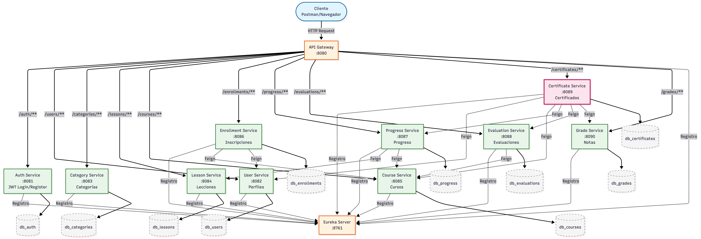

# Plataforma de Cursos Online

Backend completo de una plataforma educativa tipo "mini-Coursera" construido con arquitectura de microservicios usando Spring Boot y Spring Cloud.

---
## 🎬 Video Demostrativo
[](https://youtu.be/_ULpL4u_7-M)

---

## Arquitectura

<p align="center">
  
</p>

---

## Stack Tecnológico

| Categoría | Tecnología |
|-----------|------------|
| **Lenguaje** | Java 21 |
| **Framework** | Spring Boot 3.5 |
| **Cloud** | Spring Cloud 2025.0.2 (Eureka, Gateway, OpenFeign) |
| **Base de datos** | MySQL 8.0 (12 bases separadas, una por microservicio) |
| **Seguridad** | JWT (JJWT 0.12.6) + BCrypt |
| **Build** | Maven |
| **Utilidades** | Lombok, Jakarta Bean Validation |

---

## Microservicios

### Infraestructura (2)

| Servicio | Puerto | Descripción |
|----------|--------|-------------|
| `ms-01-eureka-server` | 8761 | Service Registry - Registro central de servicios |
| `ms-02-api-gateway` | 8080 | Entry point único - Enrutamiento y circuit breaker |

### Negocio (10)

| Servicio | Puerto | Descripción | Comunicación Feign |
|----------|--------|-------------|-------------------|
| `ms-03-auth-service` | 8081 | Autenticación JWT, login y registro | - |
| `ms-04-user-service` | 8082 | Gestión de perfiles de usuario | - |
| `ms-05-category-service` | 8083 | Categorías de cursos | - |
| `ms-06-lesson-service` | 8084 | Contenido de lecciones | - |
| `ms-07-course-service` | 8085 | Catálogo de cursos | - |
| `ms-08-enrollment-service` | 8086 | Inscripciones de estudiantes | course-service, user-service |
| `ms-09-progress-service` | 8087 | Seguimiento de progreso | lesson-service, course-service |
| `ms-10-evaluation-service` | 8088 | Evaluaciones y exámenes | course-service |
| `ms-11-certificate-service` | 8089 | Generación de certificados | user-service, course-service, progress-service, evaluation-service, grade-service |
| `ms-12-grade-service` | 8090 | Registro de notas | - |

**Total: 12 microservicios con database-per-service pattern**

---

## Funcionalidades Principales

- **Registro e identificación** de usuarios con roles diferenciados (Estudiantes, Instructores, Administradores)
- **Gestión de cursos** con catálogo, categorías y contenido multimedia
- **Inscripción** de estudiantes en cursos disponibles
- **Seguimiento de progreso** del aprendizaje con lecciones secuenciales
- **Sistema de evaluaciones** con preguntas y calificaciones
- **Registro de notas** de estudiantes en evaluaciones
- **Generación automática de certificados** al aprobar cursos (progreso 100% + evaluación aprobada)

---

## Flujo Destacado: Generación de Certificados

El servicio de certificados es el más complejo, coordinando **5 llamadas Feign** para validar:

```
1. Valida que no existe certificado previo para el usuario/curso
2. Obtiene nombre del estudiante (user-service)
3. Obtiene título del curso (course-service)
4. Verifica progreso 100% y estado COMPLETED (progress-service)
5. Obtiene evaluationId y passingScore (evaluation-service)
6. Obtiene nota del estudiante (grade-service)
7. Valida: nota >= passingScore
8. Genera código único: CERT-XXXXXXXX
9. Emite certificado
```

---

## API Endpoints

### Autenticación
| Método | Endpoint | Descripción |
|--------|----------|-------------|
| POST | `/auth/login` | Login con credenciales |
| POST | `/auth/register` | Registro de nuevo usuario |

### Gestión de Contenido (ADMIN)
| Método | Endpoint | Descripción |
|--------|----------|-------------|
| POST | `/categories` | Crear categoría |
| POST | `/courses` | Crear curso |
| POST | `/lessons` | Crear lección |
| POST | `/evaluations` | Crear evaluación |

### Operaciones de Estudiante
| Método | Endpoint | Descripción |
|--------|----------|-------------|
| POST | `/enrollments` | Inscribirse en curso |
| PATCH | `/progress/{id}/complete` | Marcar lección completada |
| POST | `/grades` | Registrar nota de evaluación |
| POST | `/certificates` | Generar certificado |

*(Todos los endpoints disponibles en `/docs/resumen.md`)*

---

## Comunicación entre Microservicios

| Servicio Origen | Servicios Destino | Propósito |
|-----------------|-------------------|-----------|
| enrollment-service | course-service, user-service | Validar existencia de curso y usuario antes de inscribir |
| progress-service | lesson-service, course-service | Obtener cantidad de lecciones y validar curso |
| evaluation-service | course-service | Validar existencia del curso |
| certificate-service | user-service, course-service, progress-service, evaluation-service, grade-service | Validar completitud del curso y generar certificado |

---

## Estructura del Proyecto

```
EA2-PlataformaCursos/
├── ms-01-eureka-server/          # Service Registry
├── ms-02-api-gateway/            # API Gateway
├── ms-03-auth-service/           # Autenticación (8081)
├── ms-04-user-service/           # Perfiles (8082)
├── ms-05-category-service/       # Categorías (8083)
├── ms-06-lesson-service/         # Lecciones (8084)
├── ms-07-course-service/         # Cursos (8085)
├── ms-08-enrollment-service/     # Inscripciones (8086) + Feign
├── ms-09-progress-service/       # Progreso (8087) + Feign
├── ms-10-evaluation-service/     # Evaluaciones (8088) + Feign
├── ms-11-certificate-service/    # Certificados (8089) + Feign x5
├── ms-12-grade-service/          # Notas (8090)
└── docs/
    └── resumen.md                # Documentación completa
```

---

## Cómo Ejecutar

### Requisitos Previos
- Java 21
- MySQL 8.0+ (puerto 3306)
- Maven

### Inicio de Servicios

**1. Iniciar Infraestructura:**
```bash
cd ms-01-eureka-server && ./mvnw spring-boot:run
cd ms-02-api-gateway && ./mvnw spring-boot:run
```

**2. Iniciar Servicios de Negocio:**
```bash
cd ms-03-auth-service && ./mvnw spring-boot:run
cd ms-04-user-service && ./mvnw spring-boot:run
# ... (repetir para ms-05 hasta ms-12)
```

**3. Verificar en Eureka:**
Acceder a `http://localhost:8761` para confirmar que los 12 servicios están registrados.

---

## Características Técnicas Destacadas

- **Database-per-Service:** Cada microservicio tiene su propia base de datos MySQL separada
- **Service Discovery:** Netflix Eureka para registro y descubrimiento de servicios
- **API Gateway:** Spring Cloud Gateway como punto de entrada único
- **Comunicación Síncrona:** OpenFeign para llamadas entre servicios con manejo de errores
- **Seguridad:** JWT para autenticación stateless
- **Soft Delete:** Eliminación lógica en todas las entidades para mantener integridad de datos
- **Validación:** Bean Validation en todos los DTOs de entrada

---

## Documentación Completa

Para información detallada sobre:
- Estructura completa de bases de datos (12 esquemas)
- Todos los endpoints y sus request/response
- Flujos de Feign Client entre servicios
- Bugs corregidos durante desarrollo

Ver: [`docs/resumen.md`](docs/resumen.md)

---

## Estado del Proyecto

- 12 microservicios implementados (10 negocio + 2 infraestructura)
- Comunicación Feign entre servicios de negocio
- Manejo de errores en llamadas inter-servicios
- Logs en cada llamada Feign
- Base de datos propia por servicio

---

## Autor

Andrés Jordán - Proyecto Evaluación Parcial 2 - Desarrollo Fullstack
